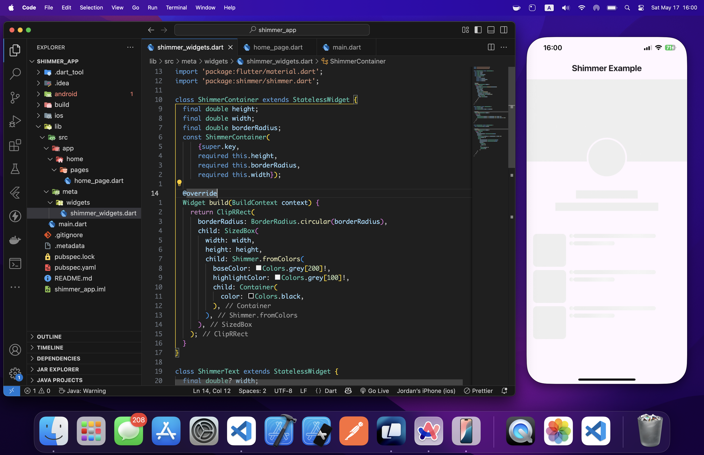

# Flutter Shimmer Loading Example

A Flutter application demonstrating the implementation of shimmer loading effects using the `shimmer` package. This example showcases how to create beautiful loading placeholders that provide a better user experience during content loading.

## Features

- Custom shimmer container widget
- Shimmer text effect
- Shimmer list tile implementation
- Responsive design
- Clean and modern UI

## Getting Started

### Prerequisites

- Flutter SDK (^3.5.2)
- Dart SDK
- Android Studio / VS Code with Flutter extensions

### Installation

1. Clone the repository:
```bash
git clone https://github.com/jordanopos/flutter-shimmer-example.git
```

2. Navigate to the project directory:
```bash
cd shimmer_app
```

3. Install dependencies:
```bash
flutter pub get
```

4. Run the app:
```bash
flutter run
```

## Project Structure

```
lib/
├── main.dart
└── src/
    ├── app/
    │   └── home/
    │       └── pages/
    │           └── home_page.dart
    └── meta/
        └── widgets/
            └── shimmer_widgets.dart
```

## Implementation Details

The project implements three main shimmer widgets:

1. `ShimmerContainer`: A customizable container with shimmer effect
2. `ShimmerText`: A text placeholder with shimmer effect
3. `ShimmerListTile`: A list tile placeholder with shimmer effect

### Usage Example

```dart
// Basic shimmer container
ShimmerContainer(
  height: 100,
  width: 200,
  borderRadius: 8,
)

// Shimmer text
ShimmerText(
  width: 150,
)

// Shimmer list tile
ShimmerListTile()
```

## Dependencies

- flutter: ^3.5.2
- shimmer: ^3.0.0
- cupertino_icons: ^1.0.8

## Contributing

Contributions are welcome! Please feel free to submit a Pull Request.

## License

This project is licensed under the MIT License - see the LICENSE file for details.

## Acknowledgments

- [shimmer](https://pub.dev/packages/shimmer) package for providing the shimmer effect functionality
